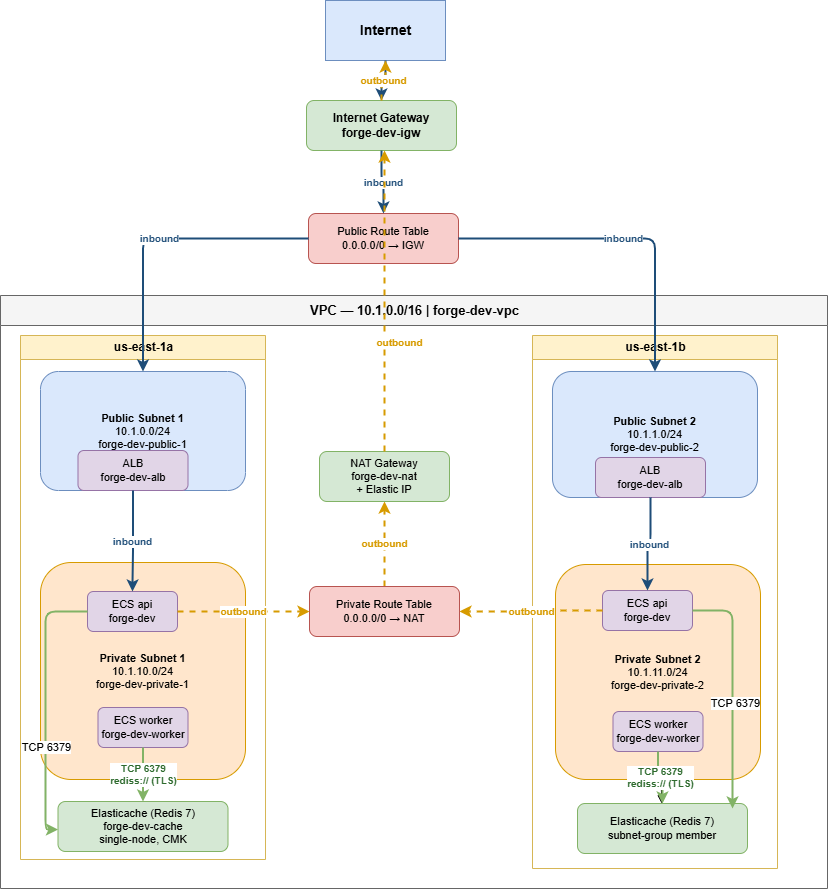

# Forge — NGX Self-Service Infrastructure Provisioning Service

[](https://github.com/njrenaissance/ngx/actions/workflows/ci.yml)
[](https://github.com/njrenaissance/ngx/actions/workflows/deploy.yml)

Forge is a platform-engineering service that accepts validated requests to
provision AWS resources, queues them for asynchronous execution, and runs
the actual provisioning through Terraform. It is the deliverable for the NGX
Senior Platform Engineer code challenge.

Forge accepts validated AWS provisioning requests over a FastAPI control
plane, persists them to Aurora Postgres, and dispatches them to a Celery
worker pool over ElastiCache Redis. The worker invokes Terraform to apply
changes against AWS. The API and worker run as separate ECS Fargate tasks
behind a shared ALB.

- **Repo**: `njrenaissance/ngx`
- **Application package**: `src/forge/`
- **AWS resources**: prefixed `forge-<env>-` (e.g. `forge-dev-vpc`)

---

## Live demo

The service is deployed and reachable:

| Endpoint | URL |
|---|---|
| Liveness | [http://forge-dev-alb-1175990339.us-east-1.elb.amazonaws.com/livez](http://forge-dev-alb-1175990339.us-east-1.elb.amazonaws.com/livez) |
| API docs | [http://forge-dev-alb-1175990339.us-east-1.elb.amazonaws.com/docs](http://forge-dev-alb-1175990339.us-east-1.elb.amazonaws.com/docs) |

Reviewers can hit these directly — no local setup required.

---

## Architecture at a glance



See [`docs/diagrams/NGX_Networking.drawio`](docs/diagrams/NGX_Networking.drawio)
for the editable source. Egress flows through a single NAT gateway
in `us-east-1a`.

Request flow: the ALB (`forge-dev-alb` on `:80`) terminates Internet
traffic and forwards to the API task (`uvicorn :8000`), which persists
incoming provisioning requests to **Aurora Postgres** over SQL and
enqueues a job onto **ElastiCache Redis** over `rediss://` (TLS). The
Celery worker task consumes from the same queue and invokes Terraform
to apply changes against AWS. API and worker run as separate ECS
Fargate tasks but share the image and the broker.

The Forge container is built on every push to `main` and published to
Amazon ECR (`<account>.dkr.ecr.<region>.amazonaws.com/forge-<env>`). Both
the API and worker tasks pull from there — same image, different entrypoint.

---

## Getting Started

### Clone and set up

```sh
git clone https://github.com/njrenaissance/ngx.git
cd ngx
uv sync
uv run pre-commit install --hook-type pre-commit --hook-type pre-push
```

Requirements: [uv](https://docs.astral.sh/uv/) and Docker Desktop (or any
Compose v2 runtime). Terraform 1.10+ is optional — only needed if you
intend to validate the AWS stack locally.

### Run unit tests

```sh
uv run pytest -m unit -v
```

### Run the service locally (no database)

```sh
uv run python -m forge
```

By default Forge listens on `0.0.0.0:8000`. Override via environment
variables (see [Configuration](#configuration) below).

```sh
curl http://localhost:8000/livez
```

### Run the full stack with Postgres and Redis

`docker-compose.yml` brings up Postgres, Redis, the API service, and the
Celery worker. Copy the example env file and edit it to configure the stack:

> **Local vs. cloud data layer:**
> `docker-compose.yml` uses vanilla Postgres and Redis for local development.
> The cloud environment (`infrastructure/dev/`) replaces these with Aurora
> Serverless v2 (Postgres-compatible) and ElastiCache for Redis. The
> application code and Celery configuration are identical in both environments
> — only the `FORGE_DATABASE__*` and `FORGE_CELERY__BROKER_URL` values differ.

```sh
cp .env.example .env
# Edit .env — set FORGE_DATABASE__PASSWORD at minimum
```

Then start the stack, passing your `.env` file explicitly:

```sh
docker compose --env-file .env up -d
curl http://localhost:8000/livez
```

All environment variables are documented in [Configuration](#configuration).
The `.env` file is gitignored — never commit it.

#### Database migrations and seed data

Bring up Postgres first, then run Alembic and the seed script.

`.env` targets the compose network (`FORGE_DATABASE__HOST=postgres`,
`FORGE_CELERY__BROKER_URL=redis://redis:6379/0`). Commands that run on
your host machine — alembic, the seed script, ad-hoc Python — can't
resolve those compose-internal DNS names, so they need localhost
overrides. Keep them in a gitignored `.env.local` next to `.env`:

```sh
# .env.local — host overrides for compose-internal hostnames
FORGE_DATABASE__HOST=localhost
FORGE_CELERY__BROKER_URL=redis://localhost:6379/0
```

Then run alembic and the seed against the running Postgres:

```sh
docker compose --env-file .env up postgres -d
uv run --env-file .env.local alembic upgrade head
uv run --env-file .env.local python db/seed.py
```

`uv run --env-file` exports the file's vars before launching, and env vars
override `.env` per pydantic-settings priority — so `.env.local` only
needs the host-vs-container deltas, not a full copy.

**Customising the seed data** — the seed script reads `db/seed.json` if it
exists, otherwise it falls back to `db/seed.json.example` (the committed
dev defaults with known API keys). To change passwords, add teams, or add
users without touching the committed example:

```sh
cp db/seed.json.example db/seed.json
# Edit db/seed.json — change api_key values, add entries, etc.
uv run --env-file .env.local python db/seed.py
```

`db/seed.json` and `.env.local` are both gitignored. Never commit them —
use `seed.json.example` for defaults that the whole team can share.

#### Smoke and load testing

We exercise the `POST /v1/resources` path against a running local stack
with two small ad-hoc scripts (kept out of version control; recipes
below). Both read the API key from `FORGE_API_KEY` — set it to a
plaintext key whose bcrypt hash is in the seeded `app_user` table.

**Smoke test** — single POST, optional `/status` poll until terminal.
Stdlib-only (`urllib`), so it runs without `uv`. Recipe:

```python
# scripts/post_resource.py — argparse over urllib.request.
# POST /v1/resources with managed_database defaults; --poll loops the
# /status endpoint until the resource reaches a terminal state
# (provisioned / failed / cancelled).
```

Usage:

```sh
export FORGE_API_KEY=<your-key>
python scripts/post_resource.py                           # one-shot
python scripts/post_resource.py --name smoke-1 --poll     # POST + watch status
```

Defaults match `db/seed.json.example`: `resource_type=managed_database`,
`tier=dev`, `logical_region=ngx-region-1a`, `engine=postgres`,
`size=small`.

**Load test** — N concurrent POSTs via `httpx.AsyncClient`, semaphore-
bounded so we don't blow past the connection pool. Reports a status-code
histogram and latency p50/p95/p99. Uses the project's httpx dep, so run
under `uv`:

```python
# scripts/load_post_resource.py — asyncio.gather of N POSTs against
# /v1/resources, each with a unique resource name. asyncio.Semaphore
# caps in-flight requests; httpx.Limits matches it on the client side.
```

Usage:

```sh
uv run python scripts/load_post_resource.py                          # 100 reqs, 20 concurrent
uv run python scripts/load_post_resource.py --count 500 --concurrency 50
```

What to expect on a healthy local stack with the **fake terraform binary**
(compose's default, `tests/_fake_terraform/fake_terraform.py`):

- All 202s from the API — the POST returns as soon as the task is enqueued.
- p50 latency dominated by bcrypt API-key verification (a few hundred ms;
  see the scaling-cliff comment in `src/forge/api/auth.py`).
- Worker concurrency is 2 with `worker_prefetch_multiplier=1` (see
  `src/forge/workers/__init__.py`), so 100 enqueues drain through the
  worker in the background while the API is already done. Redis broker
  depth stays near zero — the bottleneck is the terraform subprocess,
  not the queue.

If `.env` has `FORGE_TERRAFORM__BINARY=terraform` set, the load test will
still report all 202s (the API only enqueues), but `docker compose logs
worker` will show N back-to-back terraform-init failures because the
worker has no AWS credentials. That separation between the API path and
the provisioning path is intentional — async decoupling means a broken
provisioner doesn't make the API look broken.

Inspect queue depth and worker state directly:

```sh
docker compose exec redis redis-cli LLEN provisioning
docker compose exec worker celery -A forge.workers inspect active
docker compose exec worker celery -A forge.workers inspect reserved
```

### Run the integration tests

```sh
uv run pytest -m integration -v
```

The `pytest-docker` fixture brings up the Compose stack, waits for `/livez`
to respond, runs the suite, and tears the stack down on session exit.

---

## Configuration

### Top-level (`FORGE_*`)

| Variable | Default | Purpose |
|---|---|---|
| `FORGE_APP_NAME` | `Forge` | Service identity in `/livez` response |
| `FORGE_ENVIRONMENT` | `dev` | Free-form environment label |
| `FORGE_HOST` | `0.0.0.0` | Bind address |
| `FORGE_PORT` | `8000` | Bind port (both host and container) |
| `FORGE_RELOAD` | `false` | `true` enables uvicorn auto-reload (dev only) |
| `FORGE_REQUEST_TIMEOUT` | `30` | Seconds before uvicorn cancels a slow handler — keep below ALB idle timeout (60 s) |
| `FORGE_KEEPALIVE_TIMEOUT` | `2` | Seconds uvicorn keeps idle connections alive — keep below ALB idle timeout |
| `FORGE_SHUTDOWN_TIMEOUT` | `25` | Seconds to drain in-flight requests on SIGTERM — keep below ECS `stopTimeout` (30 s) |

### Database (`FORGE_DATABASE__*`)

| Variable | Default | Purpose |
|---|---|---|
| `FORGE_DATABASE__HOST` | `localhost` | Postgres hostname |
| `FORGE_DATABASE__PORT` | `5432` | Postgres port |
| `FORGE_DATABASE__NAME` | `forge` | Database name |
| `FORGE_DATABASE__USER` | `forge` | Database user |
| `FORGE_DATABASE__PASSWORD` | *(required)* | Set in `.env` — never committed |
| `FORGE_DATABASE__SSL_MODE` | `disable` | psycopg2 `sslmode` — set `require` in cloud |
| `FORGE_DATABASE__SCHEMA` | `public` | PostgreSQL `search_path` namespace |
| `FORGE_DATABASE__CONNECT_TIMEOUT` | `10` | Seconds to wait for TCP connect to the DB host |
| `FORGE_DATABASE__POOL_TIMEOUT` | `30` | Seconds a caller waits when the connection pool is exhausted |
| `FORGE_DATABASE__POOL_RECYCLE` | `1800` | Connection recycle interval (seconds) — keep below Aurora idle timeout |

### Celery / broker (`FORGE_CELERY__*`)

| Variable | Default | Purpose |
|---|---|---|
| `FORGE_CELERY__BROKER_URL` | *(required)* | Redis broker URL — `redis://localhost:6379/0` locally, `rediss://<elasticache-endpoint>:6379/0` in cloud |
| `FORGE_CELERY__TASK_DEFAULT_QUEUE` | `provisioning` | Queue name — must match the `-Q` flag on the worker's `celery` command |
| `FORGE_CELERY__TASK_TIME_LIMIT` | `1800` | Hard kill limit in seconds (30 min) — covers a slow `terraform apply` |
| `FORGE_CELERY__TASK_SOFT_TIME_LIMIT` | `1500` | Soft limit in seconds (25 min) — raises `SoftTimeLimitExceeded` so the task can clean up before the hard kill |

### Logging (`FORGE_LOG__*`)

| Variable | Default | Purpose |
|---|---|---|
| `FORGE_LOG__LEVEL` | `DEBUG` | Root logger level — `DEBUG` / `INFO` / `WARNING` / `ERROR` / `CRITICAL`. Also passed to uvicorn's `--log-level`. Default is `DEBUG` to surface lifecycle events in production; bump to `INFO` once the system is stable. |
| `FORGE_LOG__JSON_INDENT` | *(unset)* | Pretty-prints JSON logs across multiple lines when set (e.g. `2`). **Leave unset in production** — log aggregators expect one JSON record per line. Negative values are rejected at config-load. |

#### Log output format

Every log line is a single JSON object on stdout (NDJSON / JSONL). Standard fields:

| Field | Description |
|---|---|
| `timestamp` | ISO 8601 with UTC offset (e.g. `2026-05-12T14:49:40.099908+00:00`) |
| `level` | `DEBUG` / `INFO` / `WARNING` / `ERROR` / `CRITICAL` |
| `logger` | Dotted logger name, typically the module `__name__` (e.g. `forge.workers`) |
| `message` | Formatted log message string |
| `exc_info` | *(optional)* Full traceback as a single string with embedded `\n` newlines. JSON-safe — newlines stay escaped inside the value, the record itself stays one line. |
| *anything else* | Any keys passed via `extra={}` are merged at the top level (e.g. `resource_id`, `celery_task_id`, `tier`, `deployment_id`). |

Aggregator tip: CloudWatch Logs Insights, Datadog, and Loki all parse NDJSON natively — no custom parser needed.

#### Default level trade-off

`DEBUG` is the default so that lifecycle events (app startup, db engine init, Celery worker ready, status transitions) surface in production logs out of the box, which matters for a service in early operational maturity. The trade-off is volume: SQLAlchemy pool checkouts, Celery introspection, and uvicorn request logs all emit at DEBUG and can dominate ingestion costs.

When the system stabilises and you no longer need lifecycle visibility for every deploy, set `FORGE_LOG__LEVEL=INFO` in the relevant environment (ECS task definition, `.env`, `docker-compose`). The application's own lifecycle records are emitted at `INFO`, so you keep the operationally interesting events while dropping the DEBUG firehose.

---

## API endpoints

All `/v1/*` routes require an `X-API-Key` header.

| Method | Path | Purpose |
|---|---|---|
| `GET` | `/` | 307 redirect to `/docs` (Swagger UI) |
| `GET` | `/livez` | Liveness probe; returns `{status, message, version}` |
| `GET` | `/readyz` | Readiness probe; ALB target-group health check |
| `GET` | `/docs` | OpenAPI Swagger UI |
| `GET` | `/openapi.json` | OpenAPI 3 schema |
| `POST` | `/v1/resources` | Submit a provisioning request — returns 202 with `resource_id` and `poll_url` |
| `GET` | `/v1/resources` | List the authenticated team's resource requests (paginated) |
| `GET` | `/v1/resources/{resource_id}` | Resource detail |
| `GET` | `/v1/resources/{resource_id}/status` | Status poll endpoint (referenced by `poll_url`) |
| `GET` | `/v1/catalog/regions` | List available logical regions |
| `GET` | `/v1/catalog/tiers` | List available tier policies |
| `GET` | `/v1/catalog/resource-types` | List active resource types (latest version only) |
| `GET` | `/v1/catalog/resource-types/{name}` | Resource type detail; accepts optional `?tier=` to merge tier schema overrides |
| `GET` | `/v1/me` | Authenticated caller identity and team membership |

---

## Real-AWS provisioning (manual, opt-in)

The integration test suite uses a deterministic fake terraform binary
to exercise the plan-then-apply lifecycle without an AWS account. To
drive a real `terraform apply` against AWS, follow the
[real-AWS provisioning runbook](docs/runbooks/real-aws-provisioning.md).
It covers the bootstrap prerequisites, IAM admin steps, env-var
overrides for the worker, and manual cleanup of orphaned resources
when an apply fails partway. **Not exercised by CI.**

---

## Project structure

```text
ngx/
├── alembic/                # Database migration revisions (fix-forward only — see docs/DECISIONS.md)
├── db/                     # Seed scripts and example seed data
├── docs/                   # ADRs, SPEC, PLAN, ERD, diagrams
├── infrastructure/         # Terraform: bootstrap, dev composition, modules, policies
├── src/forge/              # FastAPI app, Celery workers, models, config
├── tests/                  # Unit (-m unit) and integration (-m integration) suites
├── docker-compose.yml      # Local API + Postgres + Redis + worker stack
├── Dockerfile              # API + worker image (same image, different entrypoint)
├── pyproject.toml          # uv project manifest; SemVer source of truth
└── uv.lock                 # Deterministic dependency lockfile
```

| Path | Purpose |
|---|---|
| `src/forge/` | FastAPI application: routers, Pydantic schemas, SQLAlchemy models, Celery app and tasks, Pydantic-settings config |
| `infrastructure/` | All Terraform — `bootstrap/` (run-once state backend), `dev/` (CI-managed environment), `modules/` (reusable child modules), `policies/` (IAM policy JSON) |
| `alembic/` | Fix-forward Alembic revisions. `downgrade()` is always `pass`. See [ADR-004](docs/DECISIONS.md#adr-004--alembic-migrations-are-fix-forward-only) |
| `db/` | `seed.py` + `seed.json.example` for local dev data |
| `docs/` | [`DECISIONS.md`](docs/DECISIONS.md), [`ERD.md`](docs/ERD.md), [`diagrams/`](docs/diagrams/) |
| `tests/` | `tests/unit/` (no I/O, run with `pytest -m unit`) and `tests/integration/` (docker-compose stack, run with `pytest -m integration`) |

---

## GitHub repository setup

The CI workflows in [`.github/workflows/`](.github/workflows/) depend on
the following repository configuration. Configure these once under
**Settings → Secrets and variables → Actions**.

### Secrets

| Secret | Value | Used by |
|---|---|---|
| `AWS_ACCESS_KEY_ID` | Access key for the legacy `ngx-deployer` IAM user | kept for historical reference; active workflows use OIDC |
| `AWS_SECRET_ACCESS_KEY` | Paired secret key | same |

> The deploy pipeline uses GitHub OIDC (see [ADR-006](docs/DECISIONS.md#adr-006--github-oidc-for-ci-deploy-authentication)) — no long-lived access keys are needed for new workflows. The legacy keys above are retained for reference only.

### Variables

| Variable | Recommended value | Used by | Notes |
|---|---|---|---|
| `AWS_REGION` | `us-east-1` | all workflows | Matches the `var.aws_region` default in Terraform |
| `AWS_DEPLOY_ROLE_ARN` | `arn:aws:iam::<account-id>:role/github-actions-ngx` | all workflows | OIDC-assumable deploy role; see One-time AWS bootstrap below |
| `ECR_REPOSITORY` | `forge-dev` | `build-container.yml`, `terraform.yml` | Matches `aws_ecr_repository.forge.name` |
| `ECS_CLUSTER` | `forge-dev` | `deploy.yml` | Matches `aws_ecs_cluster.main.name` |
| `ECS_SERVICE` | `forge-dev` | `deploy.yml` | Matches `aws_ecs_service.app.name` |

### Environment

Create a GitHub **Environment** named `production` and add at least one
required reviewer:

- **Settings → Environments → New environment → `production`**
- Add a **required reviewer** (yourself, or another repo admin)

The `terraform.yml` `apply` job targets this environment, so every
`terraform apply` against AWS waits for a human approval before proceeding.

---

## One-time AWS bootstrap

The steps below create the infrastructure that CI depends on but cannot
create for itself (it would be circular — CI needs credentials to run, but
credentials live in AWS). Run these once from a terminal with an AWS
administrator principal.

> **Account-specific ARNs:** several commands and policy documents below
> contain the account ID `328926346833`. Replace this with your own AWS
> account ID if you are deploying to a different environment. The same
> applies to any ARN-scoped resources in the policy JSON files under
> `infrastructure/policies/`.

### Terraform state backend

```sh
terraform -chdir=infrastructure/bootstrap init
terraform -chdir=infrastructure/bootstrap apply
```

This creates the `forge-tfstate-<account-id>` S3 bucket and
`forge-tfstate-lock` DynamoDB table. See
[`infrastructure/bootstrap/README.md`](infrastructure/bootstrap/README.md)
for full details. **Run once, ever. Not in CI.**

After the bootstrap:

1. Note the `state_bucket_name` output and verify it matches the bucket
   name hardcoded in `infrastructure/dev/backend.tf`.
2. The generated `terraform.tfstate` in `infrastructure/bootstrap/` is
   gitignored — keep an encrypted backup outside the repo.

### GitHub OIDC identity provider and deploy role

All CI workflows authenticate to AWS via GitHub OIDC — no long-lived access
keys. See [ADR-006](docs/DECISIONS.md#adr-006--github-oidc-for-ci-deploy-authentication)
for the rationale.

**Step 1 — Create the OIDC identity provider in AWS:**

```sh
aws iam create-open-id-connect-provider \
  --url https://token.actions.githubusercontent.com \
  --client-id-list sts.amazonaws.com \
  --thumbprint-list 6938fd4d98bab03faadb97b34396831e3780aea1
```

If the provider already exists in the account, AWS returns
`EntityAlreadyExistsException`. Verify with:

```sh
aws iam list-open-id-connect-providers
```

**Step 2 — Create the deploy IAM role** (`github-actions-ngx`) with a trust
policy scoped to this repo:

```json
{
  "Version": "2012-10-17",
  "Statement": [{
    "Effect": "Allow",
    "Principal": {
      "Federated": "arn:aws:iam::<account-id>:oidc-provider/token.actions.githubusercontent.com"
    },
    "Action": "sts:AssumeRoleWithWebIdentity",
    "Condition": {
      "StringEquals": {
        "token.actions.githubusercontent.com:aud": "sts.amazonaws.com"
      },
      "StringLike": {
        "token.actions.githubusercontent.com:sub": "repo:njrenaissance/ngx:*"
      }
    }
  }]
}
```

Save this JSON to `trust-policy.json`, then:

```sh
aws iam create-role \
  --role-name github-actions-ngx \
  --assume-role-policy-document file://trust-policy.json
```

**Step 3 — Attach both deployer policy documents to the role:**

```sh
aws iam put-role-policy \
  --role-name github-actions-ngx \
  --policy-name ngx-deployer-platform \
  --policy-document file://infrastructure/policies/ngx-deployer-platform-policy.json

aws iam put-role-policy \
  --role-name github-actions-ngx \
  --policy-name ngx-deployer-data \
  --policy-document file://infrastructure/policies/ngx-deployer-data-policy.json

aws iam put-role-policy \
  --role-name github-actions-ngx \
  --policy-name ngx-deployer-elasticache \
  --policy-document file://infrastructure/policies/ngx-deployer-elasticache-policy.json
```

The policies are inline (not managed) because each approached the 6,144
non-whitespace-character limit for AWS managed policies. Updates to any JSON
file require re-running the corresponding `put-role-policy` command before
merge.

**Step 4 — Set the `AWS_DEPLOY_ROLE_ARN` GitHub Actions variable:**

Under **Settings → Secrets and variables → Actions → Variables**, set
`AWS_DEPLOY_ROLE_ARN` to
`arn:aws:iam::<account-id>:role/github-actions-ngx`.

**Step 5 — Re-run any failed workflow** — it should now assume the role
successfully via OIDC.

### AWS service-linked roles

AWS auto-creates service-linked roles on first use of a service, provided
the deployer has `iam:CreateServiceLinkedRole` scoped to that service. The
checked-in policy documents grant this for:

| Service-linked role | Granted by |
|---|---|
| `AWSServiceRoleForElasticLoadBalancing` | `ServiceLinkedRoles` sid — `ngx-deployer-platform-policy.json` |
| `AWSServiceRoleForECS` | `ServiceLinkedRoles` sid — `ngx-deployer-platform-policy.json` |
| `AWSServiceRoleForRDS` | `RDSServiceLinkedRole` sid — `ngx-deployer-data-policy.json` |
| `AWSServiceRoleForElastiCache` | `ElastiCacheServiceLinkedRole` sid — `ngx-deployer-elasticache-policy.json` |

---

## CI/CD pipeline

Four GitHub Actions workflows orchestrate the delivery:

### 1. `format-lint.yml` + `unit-tests.yml` + `ci.yml`

Runs on every PR against main:

- `ruff format --check` and `ruff check` against `src/` and `tests/`
- `mypy src/`
- `pytest -m unit` with coverage

These have no AWS dependencies.

### 2. `build-container.yml`

Triggers on push to `main` (and `workflow_dispatch`). Builds the Forge image
and pushes to Amazon ECR with three tag styles:

- `:latest` (always overwrites)
- `:<pyproject-version>` (e.g. `:0.1.0`)
- `:<short-sha>` (commit SHA, immutable per build)

Skips file paths that don't affect the image (`docs/`, `*.md`,
`infrastructure/`, `.claude/`).

To pull the image locally for inspection:

```sh
aws ecr get-login-password --region us-east-1 \
  | docker login --username AWS --password-stdin <account>.dkr.ecr.us-east-1.amazonaws.com
docker pull <account>.dkr.ecr.us-east-1.amazonaws.com/forge-dev:latest
```

### 3. `terraform.yml`

Triggers on PR (`plan` only) and push to `main` (`plan` then `apply`).

| Job | When | What |
|---|---|---|
| `plan` | PR + main | `fmt -check` → `init` → `validate` → `plan`, posts the plan as a PR comment, uploads `tfplan` artifact |
| `apply` | main only | Requires `production` environment approval, then `terraform apply tfplan` |

`fmt`, `validate`, and `plan` run as steps in the same job to avoid paying
runner-spinup overhead twice. `apply` is a separate job only because GitHub
Environment approval gates are job-scoped — there is no way to pause a
single step waiting for a reviewer.

### 4. `deploy.yml`

Triggers automatically after `build-container.yml` finishes successfully on
`main`. Runs `aws ecs update-service --force-new-deployment`, then blocks
on `aws ecs wait services-stable` so the workflow only succeeds once the
new tasks are healthy.

### End-to-end flow for a typical change

```text
   ┌─ Open PR ─────────────────────────────────────────────┐
   │  format-lint.yml ✓ unit-tests.yml ✓                    │
   │  terraform.yml: fmt+validate+plan → comment on PR ✓    │
   └────────────────────────────────────────────────────────┘
            │
            │ (review, approve, merge to main)
            ▼
   ┌─ Push to main ────────────────────────────────────────┐
   │  build-container.yml → pushes :latest + :version to    │
   │                        ECR                             │
   │  terraform.yml: plan + apply (production gate ⏸)       │
   │  deploy.yml: aws ecs update-service                    │
   │              wait services-stable                      │
   └────────────────────────────────────────────────────────┘
            │
            ▼
   curl http://forge-dev-alb-1175990339.us-east-1.elb.amazonaws.com/livez  → 200 OK
```

---

## Infrastructure layout

```text
infrastructure/
├── bootstrap/          # Terraform state backend — RUN ONCE manually
│   ├── README.md       # Operating procedure
│   ├── main.tf         # S3 bucket + DynamoDB lock table
│   └── ...
├── dev/                # The dev environment stack — CI-managed
│   ├── backend.tf      # S3 backend with use_lockfile = true
│   ├── main.tf         # VPC, ALB, ECS, ECR, IAM, CloudWatch, Aurora, ElastiCache
│   ├── providers.tf
│   ├── variables.tf
│   └── terraform.tfvars.example
├── modules/            # Reusable child modules, each with terraform test suites
│   ├── alb/            # Application Load Balancer + listener + target group
│   ├── cache/          # ElastiCache for Redis (Celery broker)
│   ├── database/       # Aurora Serverless v2 (Postgres)
│   ├── ecr/            # ECR repository + lifecycle policy
│   ├── ecs_service/    # ECS cluster + API task + worker task + IAM roles
│   ├── kms/            # Customer-managed KMS key (CMK) + alias
│   └── network/        # VPC, subnets, NAT gateway, shared app security group
└── policies/
    ├── ngx-deployer-platform-policy.json   # ECS, ALB, ECR, IAM, CloudWatch
    └── ngx-deployer-data-policy.json       # S3, DynamoDB, KMS, Secrets Manager, RDS
```

### First-time setup (one-time)

If you are starting from a fresh AWS account:

1. **Create the OIDC provider and deploy role** as described in
   [One-time AWS bootstrap](#one-time-aws-bootstrap) above.
2. **Run the bootstrap** to create the Terraform state backend:

   ```sh
   terraform -chdir=infrastructure/bootstrap init
   terraform -chdir=infrastructure/bootstrap apply
   ```

   This creates `forge-tfstate-<account-id>` (S3) and `forge-tfstate-lock`
   (DynamoDB). It runs once forever. See
   [`infrastructure/bootstrap/README.md`](infrastructure/bootstrap/README.md).

3. **Update `infrastructure/dev/backend.tf`** to reference the bucket name
   that the bootstrap printed (if your account ID differs from the one
   currently hardcoded).
4. **Configure GitHub secrets/variables/environments** as described above.
5. **Open a PR** with any change to `infrastructure/dev/**` to confirm the
   pipeline runs end-to-end.

### Day-to-day infrastructure changes

Edit any file in `infrastructure/dev/`, open a PR, review the plan comment,
merge. The pipeline does the rest.

---

## IAM roles and policies

### Deploy-time (out-of-band, GitHub Actions)

The `github-actions-ngx` role is assumed via OIDC by every CI workflow —
see [ADR-006](docs/DECISIONS.md#adr-006--github-oidc-for-ci-deploy-authentication)
and [One-time AWS bootstrap](#one-time-aws-bootstrap).

Attached inline policies (in [`infrastructure/policies/`](infrastructure/policies/)):

| Policy file | Coverage |
|---|---|
| [`ngx-deployer-platform-policy.json`](infrastructure/policies/ngx-deployer-platform-policy.json) | VPC, ALB, ECS, IAM (scoped to `forge-*`), CloudWatch Logs, ECR, ELB + ECS service-linked-role creation |
| [`ngx-deployer-data-policy.json`](infrastructure/policies/ngx-deployer-data-policy.json) | S3, DynamoDB, KMS, Secrets Manager, RDS, RDS service-linked-role creation |
| [`ngx-deployer-elasticache-policy.json`](infrastructure/policies/ngx-deployer-elasticache-policy.json) | ElastiCache replication group, subnet group, parameter group, KMS grants, ElastiCache service-linked-role creation |

The policies are split because each was approaching the 6,144
non-whitespace-character cap for AWS managed policies; separate files also
map cleanly to domain review boundaries.

**Updates to either file require re-running `aws iam put-role-policy` on
the `github-actions-ngx` role before the PR merges.** Call this out
explicitly in the PR description.

### Runtime (Terraform-managed)

All three roles are defined in
[`infrastructure/modules/ecs_service/main.tf`](infrastructure/modules/ecs_service/main.tf)
and named `forge-<env>-<suffix>`:

| Role name | Assumed by | Purpose |
|---|---|---|
| `forge-dev-ecs-execution-role` | ECS orchestrator | Pulls image from ECR, fetches `FORGE_DATABASE__PASSWORD` from Secrets Manager, decrypts with CMK, writes CloudWatch logs. Shared between API and worker tasks. |
| `forge-dev-ecs-task-role` | API container | Zero attached policies today — the API has no direct AWS API calls. Reserved as the attachment point for future API-only grants. |
| `forge-dev-ecs-worker-task-role` | Worker container | Zero attached policies today. Split from the API role per [ADR-012](docs/DECISIONS.md#adr-012--worker-iam-role-split-shared-execution-role-separate-task-role) to isolate future S3 permissions (#51) from the API blast radius. |

---

## Engineering conventions

See [`CLAUDE.md`](CLAUDE.md) for the working agreement. Key rules:

- `uv` for all Python tooling (`uv sync`, `uv run pytest`, etc.)
- Pre-commit hooks enforced — install with
  `uv run pre-commit install --hook-type pre-commit --hook-type pre-push`
- Conventional commits (`feat:`, `fix:`, `chore:`, …) with a
  `Co-Authored-By` trailer when AI-assisted
- SemVer in `pyproject.toml`; bump on any `src/forge/**` change
- Diagrams under `docs/diagrams/` must stay in sync with the Terraform stack
- Bootstrap is run-once-ever and is NOT touched by CI

---

## Further reading

- [docs/ERD.md](docs/ERD.md) — data model
- [docs/DECISIONS.md](docs/DECISIONS.md) — architectural decision records (ADR-001 through ADR-016)
- [docs/diagrams/NGX_Networking.drawio](docs/diagrams/NGX_Networking.drawio) — editable network topology source
- [CLAUDE.md](CLAUDE.md) — engineering working agreement
