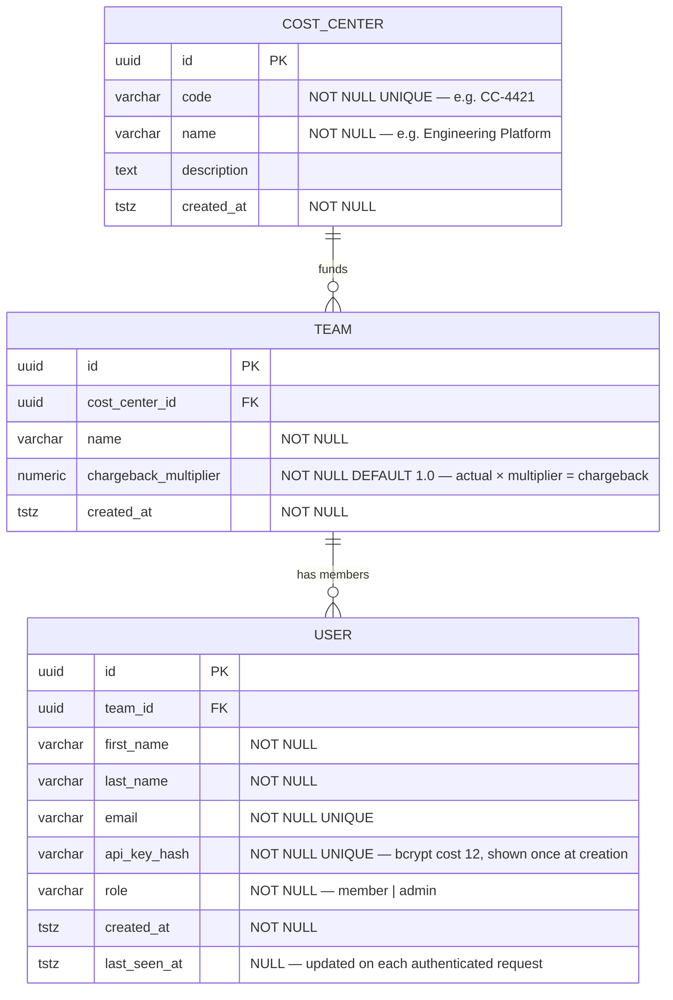
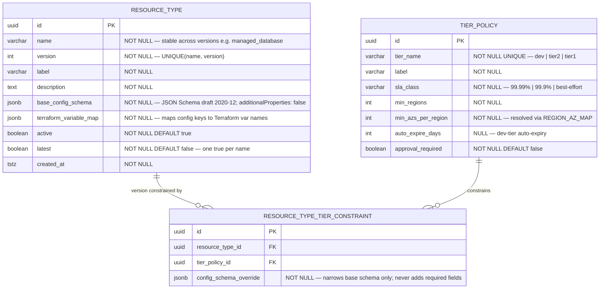
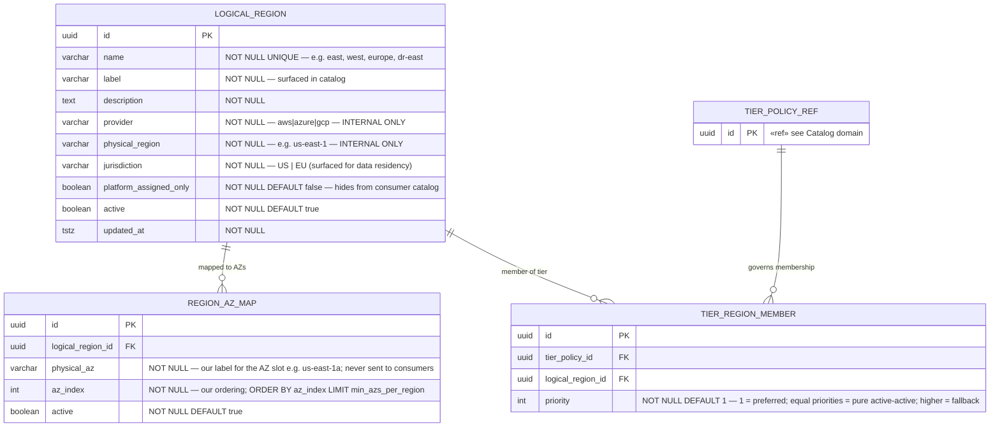
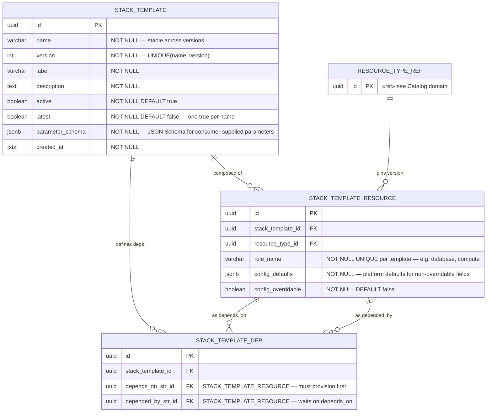
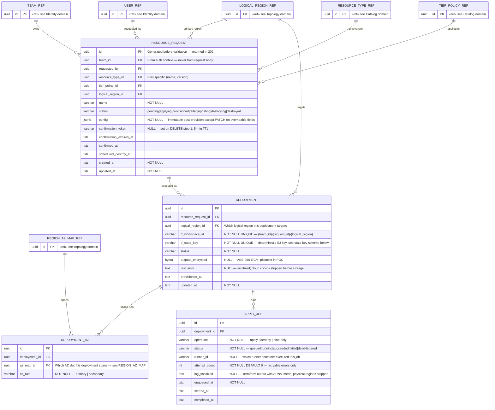
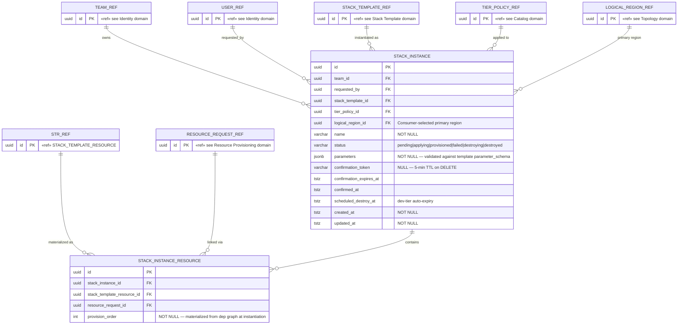
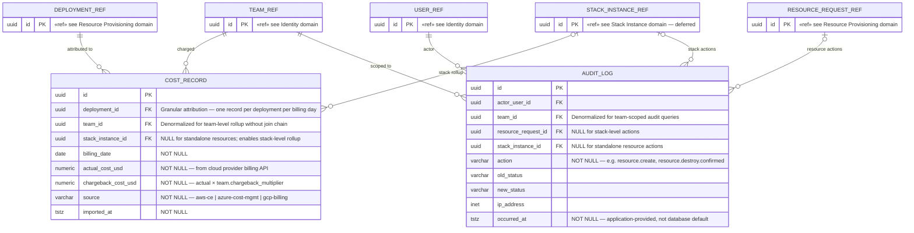

# Entity Relationship Diagram — Cloud Resource Provisioning Platform

Source of truth: `docs/cloud-provisioning-platform-spec_1.docx` v2.0 (May 2026).

The schema is split into seven diagrams by data domain. Cross-domain references appear as stub entities (PK only, marked `«ref»`) so each diagram is self-contained.

Domains marked **deferred** are fully designed but not part of the initial implementation.

---

## Domain map

| # | Domain | Tables | Status |
| --- | ------ | ------ | ------ |
| 1 | [Identity & Auth](#1-identity--auth) | `COST_CENTER`, `TEAM`, `USER` | v1 |
| 2 | [Catalog](#2-catalog) | `RESOURCE_TYPE`, `TIER_POLICY`, `RESOURCE_TYPE_TIER_CONSTRAINT` | v1 |
| 3 | [Topology](#3-topology) | `LOGICAL_REGION`, `REGION_AZ_MAP`, `TIER_REGION_MEMBER` | v1 |
| 4 | [Stack Template](#4-stack-template) | `STACK_TEMPLATE`, `STACK_TEMPLATE_RESOURCE`, `STACK_TEMPLATE_DEP` | schema only — provisioning deferred |
| 5 | [Resource Provisioning](#5-resource-provisioning) | `RESOURCE_REQUEST`, `DEPLOYMENT`, `DEPLOYMENT_AZ`, `APPLY_JOB` | v1 |
| 6 | [Stack Instance](#6-stack-instance-deferred) | `STACK_INSTANCE`, `STACK_INSTANCE_RESOURCE` | deferred |
| 7 | [Finance](#7-finance) | `COST_RECORD`, `AUDIT_LOG` | v1 |

---

## 1. Identity & Auth

Owns the authorization boundary. `team_id` is resolved from the authenticated `USER` record on every request and is never accepted from the client.

---

## 2. Catalog

The self-describing discovery surface. `RESOURCE_TYPE` rows are immutable once active instances exist — new behavior always goes into a new `version`.

---

## 3. Topology

All AZ and multi-region topology encoded as data. Consumers select logical regions; physical coordinates are internal-only and never appear in API responses.

Regions are modeled as a flat membership set per tier — not as primary/secondary pairs. This supports active-active (all members at `priority = 1`), active-passive (mixed priorities), and N-region topologies without schema changes.

`REGION_AZ_MAP` is **our** abstraction — the platform team populates and owns it. It is not derived from or synced with a cloud provider API. We decide which AZ slots exist, what we call them, and which are active. The `physical_az` value is an internal label used by the provisioning engine; it never reaches consumers.

### Priority semantics

| `priority` pattern | Topology |
| --- | --- |
| All members = 1 | Active-active — platform provisions simultaneously, traffic distributed equally |
| One member = 1, rest ≥ 2 | Active-passive — platform provisions all, traffic routing favors priority 1 |
| Mixed priorities across N members | Weighted preference — e.g. east(1), west(1), europe(2) means two hot, one warm standby |

---

## 4. Stack Template

Template definitions with an explicit dependency graph. Provisioning is stubbed in v1 — the schema and catalog are complete so v2 has full scaffolding.

---

## 5. Resource Provisioning

The core async lifecycle for standalone resources (v1). One `DEPLOYMENT` per logical region per resource request. One state file per `DEPLOYMENT` — independent lock scope and blast radius containment.

Stack-owned resources (`STACK_INSTANCE`, `STACK_INSTANCE_RESOURCE`) are in the deferred [Stack Instance](#6-stack-instance-deferred) domain and do not appear here.

### State key scheme

| Scenario | S3 key pattern |
| -------- | -------------- |
| Standalone resource | `{env}/{team_id}/standalone/{resource_request_id}/{logical_region}/terraform.tfstate` |
| Stack resource (deferred) | `{env}/{team_id}/{stack_instance_id}/{logical_region}/{role_name}/terraform.tfstate` |

---

## 6. Stack Instance (deferred)

> **Not in v1 implementation.** The schema is complete so v2 has full scaffolding. `POST /v1/stacks` is stubbed — it validates parameters and creates the `STACK_INSTANCE` row but does not enqueue provisioning.

---

## 7. Finance

Cost attribution and immutable audit trail. `team_id` is denormalized onto both tables for efficient team-scoped queries without a join chain.

---

## Design rules

| Rule | Detail |
| ---- | ------ |
| **PKs** | All UUIDs, generated by the application layer before any validation |
| **`team_id` boundary** | Resolved from the authenticated `USER` record on every request — never from query params, body, or path |
| **Immutability** | `RESOURCE_TYPE` rows are locked once any `RESOURCE_REQUEST` pointing to `(name, version)` has `status != destroyed` |
| **Immutable fields post-provision** | `resource_type_id`, `tier_policy_id`, `logical_region_id` on `RESOURCE_REQUEST` and `STACK_INSTANCE` — `PATCH` returns 422 if these are sent |
| **State isolation** | One `DEPLOYMENT` per resource × logical region → one S3 state file → independent lock scope |
| **Cloud coordinate embargo** | `physical_region`, `physical_az`, `provider`, ARNs exist in DB for internal use only — any serializer that exposes them is a bug |
| **Apply discipline** | Always `plan → save plan file → gate → apply from saved file` — never a fresh `apply` |
| **Single team per user (v1)** | `USER.team_id` is a single FK — a user belongs to exactly one team. The v2 path is a `USER_TEAM` junction table (`user_id`, `team_id`, `role`, `is_primary`) with the auth middleware selecting the active team from a session or request header. |

---

## Required seed data

### Logical regions

| `name` | `provider` | `physical_region` | `jurisdiction` | `platform_assigned_only` | Notes |
| --- | --- | --- | --- | --- | --- |
| `ngx-region-1a` | `aws` | `us-east-1` | `US` | `false` | Our canonical region label — consumers see `ngx-region-1a`, never `us-east-1` |

### Region AZ map

| `logical_region` | `physical_az` | `az_index` |
| --- | --- | --- |
| `ngx-region-1a` | `us-east-1a` | `1` |

### Tier policies

| `tier_name` | `sla_class` | `min_regions` | `min_azs_per_region` | `auto_expire_days` | `approval_required` |
| --- | --- | --- | --- | --- | --- |
| `experimental` | `best-effort` | `1` | `1` | `30` | `false` |
| `dev` | `best-effort` | `1` | `1` | `90` | `false` |
| `tier2` | `99.9%` | `1` | `2` | `null` | `false` |
| `tier1` | `99.99%` | `2` | `2` | `null` | `false` |

### Tier region membership

| `tier_name` | `logical_region` | `priority` |
| --- | --- | --- |
| `experimental` | `ngx-region-1a` | `1` |
| `dev` | `ngx-region-1a` | `1` |
| `tier2` | `ngx-region-1a` | `1` |
| `tier1` | `ngx-region-1a` | `1` |
